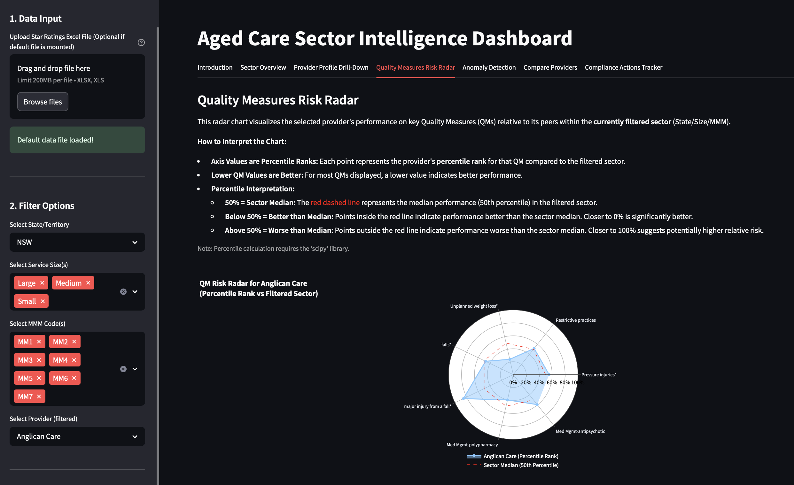

# Aged Care Sector Intelligence Dashboard

[](https://opensource.org/licenses/MIT)
<!-- Optional: Add other badges like build status if you set up CI properly -->

## Overview

The Aged Care Sector Intelligence Dashboard is a data-driven regulatory intelligence tool designed to assist analysis of sector performance across Australia's aged care providers. Built using Streamlit and Plotly, this dashboard enables users to explore sector-wide trends and drill down into specific provider profiles using data from sources like the Aged Care Quality Data quarterly extracts.

It focuses on combining key regulatory metrics including:

*   Star Ratings (Overall, Compliance, Staffing, Quality Measures, Residents' Experience)
*   Compliance History (recorded compliance actions)
*   Residents' Experience survey breakdown
*   Staffing compliance relative to benchmark minutes
*   Quality Measures (pressure injuries, falls, restrictive practices, medication management, etc.)

The dashboard is designed to support regulatory oversight, market stewardship, and early identification of service risks.

<!-- Optional: Add a screenshot here -->


## Features

### Sector Overview (Planned Finalisation)

*   High-level visualisation of sector performance by State, Territory, and Remoteness.
*   Average star ratings and quality indicators across the nation and by regions.

### Provider Drill-Down (Implemented)

*   Select a specific provider from a dynamic filter.
*   Summarised provider profile:
    *   Number of service suburbs operated
    *   Number of small, medium, and large services
*   Key compliance and quality metrics displayed:
    *   Overall Star Rating (average)
    *   Registered Nurse Care Compliance (% of required minutes)
    *   Total Care Minutes Compliance (%)
*   Average quality measures across services (bar chart with error bars showing standard error of the mean).
*   Distribution of quality indicators across services (box plot with individual service points; outliers highlighted in red).
*   **Compliance History Table:**
    *   Displays services with recorded compliance actions.
*   **Serious Concerns Alert:**
    *   Highlights any services with concerning indicators (e.g., Star Rating <= 2, poor compliance ratings).
    *   Services displayed with red background for easy visibility.
*   All numeric values formatted to one decimal place for professionalism.
*   Consistent, clean visual design optimised for stakeholder presentations.

## Technical Stack

*   **Frontend Framework:** [Streamlit](https://streamlit.io/)
*   **Plotting Library:** [Plotly Express](https://plotly.com/python/plotly-express/)
*   **Data Management:** [Pandas](https://pandas.pydata.org/)
*   **Containerisation:** [Docker](https://www.docker.com/) (optional for deployment)

## Setup Instructions

### Prerequisites

*   Python 3.8+
*   Git

### Installation

1.  **Clone the repository:**
    ```bash
    git clone https://github.com/[Your GitHub Username]/[New Repository Name].git
    cd [New Repository Name]
    ```

2.  **Create and activate a virtual environment (Recommended):**
    *   On macOS/Linux:
        ```bash
        python3 -m venv venv
        source venv/bin/activate
        ```
    *   On Windows:
        ```bash
        python -m venv venv
        .\venv\Scripts\activate
        ```

3.  **Install required Python libraries:**
    ```bash
    pip install -r requirements.txt
    ```

### Data Requirements

*   This dashboard requires the **Star Ratings Quarterly Data Extract** Excel file.
*   The application currently expects the file named `star-ratings-quarterly-data-extract-february-2025.xlsx` to be present in the **same directory** as `app.py`.
*   **Note:** This data file is **not included** in the repository due to its size and potential sensitivity. You must obtain it separately.
    *   *(Suggestion for future: Consider adding functionality to upload the file via the Streamlit interface or configure the path).*

## Usage

1.  Ensure your virtual environment is activated and the required Excel data file is in place (see Data Requirements).
2.  Run the Streamlit application:
    ```bash
    streamlit run app.py
    ```
3.  Open your web browser and navigate to `http://localhost:8501` (or the URL provided by Streamlit).

## Docker Deployment (Optional)

If you have Docker installed, you can build and run the dashboard in a container:

1.  **Build the Docker image:**
    ```bash
    docker build -t agedcare-dashboard .
    ```

2.  **Run the container:**
    *   If port 8501 is available:
        ```bash
        # Make sure to mount or copy the data file into the container
        # Example (adjust path to your local data file):
        # docker run -p 8501:8501 -v /path/to/your/local/star-ratings-quarterly-data-extract-february-2025.xlsx:/app/star-ratings-quarterly-data-extract-february-2025.xlsx agedcare-dashboard

        # Simpler if Dockerfile copies it (modify Dockerfile needed):
        docker run -p 8501:8501 agedcare-dashboard
        ```
    *   If port 8501 is in use, map to a different port (e.g., 8510):
        ```bash
        # Adjust data mounting as above if needed
        docker run -p 8510:8501 agedcare-dashboard
        ```
    *   **Note:** The provided `Dockerfile` (if you create one) would need instructions (e.g., `COPY`) to include `app.py`, `requirements.txt`, and potentially handle the data file, or you need to use volume mounts (`-v`) as shown above.

## Known Limitations

*   **Text-centering in tables:** Due to Streamlit's current `st.dataframe()` limitations, full centre-alignment of text and numbers within tables is not supported. Numbers are right-aligned, and text is left-aligned by default.
*   **Large datasets:** While the dashboard can handle national datasets (thousands of records), extremely large Excel files (>50MB) may lead to longer loading times or require more memory. Pre-processing might be beneficial for very large files.
*   **Hardcoded Data File Name:** The application currently expects a specific file name (`star-ratings-quarterly-data-extract-february-2025.xlsx`).

## Future Enhancements

*   Finalise sector-wide dashboard visualisation tabs.
*   Build dynamic serious-risk leaderboards.
*   Potential integration of GEM (Government Entry Management) or Sector Performance Reports automatically.
*   Add functionality to simulate predictive risk scores based on longitudinal trends.
*   Implement fine-grained filters (e.g., by compliance type, indicator thresholds).
*   Allow data file upload via the UI or configuration of the file path.

## Contributing

Contributions, issues, and feature requests are welcome. Please feel free to open an issue or submit a pull request.
*(Optional: Add more detailed contribution guidelines in a CONTRIBUTING.md file)*

## Author

*   **Stuart Smith** – Aged Care Sector Regulatory Intelligence Specialist and Dashboard Developer.

## License

This project is licensed under the MIT License - see the [LICENSE](LICENSE) file for details.

## Disclaimer

This dashboard is a demonstrator model created for intelligence and policy analysis purposes. It does not constitute an official regulatory determination or guarantee service quality independently of Commission assessment processes. Data interpretation should always consider the context and limitations outlined in the official data source documentation.
