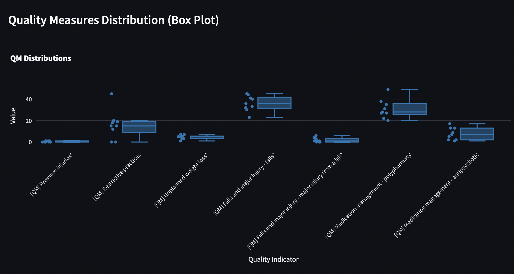

--- START OF FILE README.md ---

# Aged Care Sector Intelligence Dashboard

[](https://opensource.org/licenses/MIT)

## Introduction

**Data Source:** This dashboard is designed specifically for analysing data from the official **Star Ratings quarterly data extract** published by the Australian Government. :contentReference[oaicite:0]{index=0}

- **Content:** This extract provides service-level Star Ratings data (Overall and component ratings) for government-funded residential aged care homes at a specific point in time. It typically includes sheets like 'Star Ratings' and 'Detailed data'.
- **Origin:** The data is usually found via the GEN Aged Care Data website and hosted on the Department of Health and Aged Care resources section.
- **How to Obtain:** You must manually download the desired quarterly extract file (`.xlsx`) from the official government sources. The exact download location changes with each release. Start your search here:
  - **GEN Aged Care Data:** [https://www.gen-agedcaredata.gov.au/](https://www.gen-agedcaredata.gov.au/) (Look for Star Ratings or quarterly reports)
  - _Example Path (May Change):_ You might navigate through GEN -> Specific Quarter Report -> `health.gov.au` Publication Page -> Final `.xlsx` Link.

**Using the Dashboard:**

1.  **Obtain the File:** Download the specific quarterly `.xlsx` data extract you wish to analyse.
2.  **Upload:** Use the sidebar (**1. Data Input**) to upload the downloaded Excel file.
3.  _(Alternative)_ If running via Docker with a volume mount, the application may load a default file named `star-ratings-quarterly-data-extract-february-2025.xlsx` if no file is uploaded.
4.  **Analyze:** Use the sidebar filters and navigate the tabs above to explore the data.

> When you first open the dashboard, the **Introduction** tab welcomes you and outlines how to upload your Star Ratings extract, apply filters (State/Territory, Service Size, MMM Code, Provider), and navigate the analytical tabs (Sector Overview, Provider Drill-Down, Risk Radar, Anomaly Detection, Compare Providers).

> **Important:** Please ensure you are using the official and complete `star-ratings-quarterly-data-extract-february-2025.xlsx` (or similar) Excel file. The accuracy of the analysis depends entirely on the structure and content of the uploaded data matching the expected format.

This dashboard will eventually be populated by real-time Star Rating data, either shared directly in a Data Clean Room (DCR) by participating providers or accessed via API directly from the Department's GEM website.

## Overview

The Aged Care Sector Intelligence Dashboard is a data-driven regulatory intelligence tool designed to assist analysis of sector performance across Australia's aged care providers. Built using Streamlit and Plotly, this dashboard enables users to explore sector-wide trends and drill down into specific provider profiles using data from sources like the Aged Care Quality Data quarterly extracts.

It focuses on combining key regulatory metrics including:

- Star Ratings (Overall, Compliance, Staffing, Quality Measures, Residents' Experience)
- Compliance History (recorded compliance actions)
- Residents' Experience survey breakdown
- Staffing compliance relative to benchmark minutes
- Quality Measures (pressure injuries, falls, restrictive practices, medication management, etc.)



This dashboard enables providers with multiple sites to view how each site is performing using this box plot.

## Features

### Sector Overview (Planned Finalisation)

- High-level visualisation of sector performance by State, Territory, and Remoteness.
- Average star ratings and quality indicators across the nation and by regions.

### Provider Drill-Down (Implemented)

- Select a specific provider from a dynamic filter.
- Summarised provider profile:
  - Number of service suburbs operated
  - Number of small, medium, and large services
- Key compliance and quality metrics displayed:
  - Overall Star Rating (average)
  - Registered Nurse Care Compliance (% of required minutes)
  - Total Care Minutes Compliance (%)
- Average quality measures across services (bar chart with error bars showing standard error of the mean).
- Distribution of quality indicators across services (box plot with individual service points; outliers highlighted in red).
- **Compliance History Table:**
  - Displays services with recorded compliance actions.
- **Serious Concerns Alert:**
  - Highlights any services with concerning indicators (e.g., Star Rating ≤ 2, poor compliance ratings).
  - Services displayed with red background for easy visibility.
- All numeric values formatted to one decimal place for professionalism.
- Consistent, clean visual design optimised for stakeholder presentations.

## Technical Stack

- **Frontend Framework:** [Streamlit](https://streamlit.io/)
- **Plotting Library:** [Plotly Express](https://plotly.com/python/plotly-express/)
- **Data Management:** [Pandas](https://pandas.pydata.org/)
- **Containerisation:** [Docker](https://www.docker.com/) (optional for deployment)

## Setup Instructions

### Prerequisites

- Python 3.8+
- Git

### Installation

1. **Clone the repository:**
   ```bash
   git clone https://github.com/[Your GitHub Username]/[New Repository Name].git
   cd [New Repository Name]
   ```
