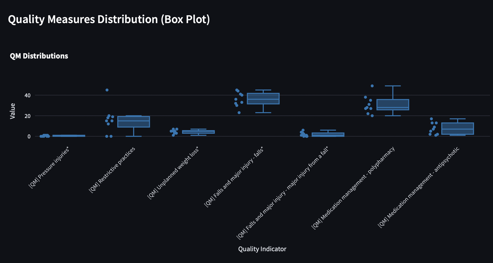

# Aged Care Sector Intelligence Dashboard

[](https://opensource.org/licenses/MIT)

A regulatory intelligence tool for analysing performance across Australia's
residential aged care providers. A static client-side app — no server, no cold
start, and uploaded data never leaves your browser.

## Overview

The dashboard explores sector-wide trends and drills into individual provider
profiles using the Australian Government's Star Ratings quarterly data extract.
It combines:

- Star Ratings (Overall, Compliance, Staffing, Quality Measures, Residents' Experience)
- Compliance history and recorded regulatory decisions
- Residents' Experience survey breakdown
- Staffing compliance relative to benchmark care minutes
- Quality Measures (pressure injuries, falls, restrictive practices, medication management, and more)



Providers running multiple sites can use the box plot above to see how each site
performs relative to the others.

## Data source

This dashboard analyses the official **Star Ratings quarterly data extract**
published by the Australian Government.

- **Content:** service-level Star Ratings (overall and component) for
  government-funded residential aged care homes at a point in time. The workbook
  must contain a `Star Ratings` sheet and a `Detailed data` sheet.
- **Origin:** published via the GEN Aged Care Data website and the Department of
  Health and Aged Care resources section.
- **How to obtain:** download the quarterly `.xlsx` manually — the location
  changes with each release. Start at
  [GEN Aged Care Data](https://www.gen-agedcaredata.gov.au/) and look for Star
  Ratings or the quarterly reports.

The February 2025 extract ships with this repository and loads automatically.
To analyse a different quarter, drop its `.xlsx` onto the sidebar. It is parsed
in your browser and never uploaded.

> **Important:** accuracy depends entirely on the uploaded workbook matching the
> expected structure. The app validates the required sheets and columns on load
> and reports clearly if something is missing.

## Tabs

| Tab | What it does |
| --- | --- |
| **Introduction** | Data provenance and usage instructions. |
| **Sector Overview** | Headline compliance metrics and distribution plots for the filtered sector. |
| **Provider Profile Drill-Down** | Provider profile, key metrics, Residents' Experience breakdown, quality-measure averages with standard error, per-site box plots, compliance history, and services breaching absolute concern thresholds. |
| **Quality Measures Risk Radar** | Provider percentile ranks per quality measure against filtered sector peers, with a narrative summary of relative strengths and concerns. |
| **Anomaly Detection** | IQR-based outlier screening across seven metrics, with counts by metric and provider. |
| **Compare Providers** | Provider averages against sector median / 75th / 90th percentile benchmarks, excluding the provider itself from its own peer group. |
| **Compliance Actions Tracker** | Recorded regulatory decisions: counts, breakdown by type and state, a monthly timeline, and a searchable, downloadable decision register. |

Sidebar filters (State/Territory, Service Size, MMM Code, Provider) apply across
every tab. The sector filters define the peer group used for all benchmarking.

## Running locally

**Prerequisites:** Node 20+ and Git.

```bash
git clone https://github.com/stu2454/agedcare-intelligence-dashboard.git
cd agedcare-intelligence-dashboard/web

npm install
npm run dev
```

The app is served at <http://localhost:5173>. The bundled extract is copied into
`web/public/` automatically before `dev`, `build` and `test`, so the workbook
lives in exactly one place in version control.

```bash
npm run build      # production bundle into web/dist
npm run preview    # serve that bundle locally
npm test           # unit and parity tests
npm run typecheck  # tsc --noEmit
```

## Tests

```bash
cd web && npm test
```

Three suites:

- **`stats.test.ts`** — the statistics helpers, asserted against known
  numpy/pandas/scipy outputs so quantiles, standard errors and percentile ranks
  stay faithful to the original implementation.
- **`parse.test.ts`** — parsing and cleaning: percent-formatted text, zero and
  missing care-minutes targets, day-first dates, blank categoricals.
- **`parity.test.ts`** — loads the real bundled extract and asserts the output
  matches `python-reference.json`, generated from the previous pandas
  implementation. Row counts, means to eight decimal places, all 281 outlier
  findings with their per-metric breakdown, and the concern-flag count all
  match, so the rewrite is provably not a behaviour change.

## Deploying to Render

The repository includes a [`render.yaml`](render.yaml) blueprint defining a
**Static Site**.

1. In the Render dashboard choose **New → Blueprint** and select this repository.
2. Render reads `render.yaml`, runs `cd web && npm ci && npm run build`, and
   publishes `web/dist`.
3. Deploy. Subsequent pushes to `main` deploy automatically.

Because it is a static site rather than a web service:

- **It is free and never sleeps.** The previous Docker web service was reclaimed
  by Render after a period of inactivity on the free plan, which is why its URL
  started returning "Not found".
- **There is no cold start.** Nothing has to wake up before the first request.
- **There is no server to attack.** The blueprint sets a strict
  Content-Security-Policy; the app makes no network requests at all after load.

## Architecture

The dashboard is a static client-side app. There is no backend.

- The bundled extract is fetched and parsed **in the browser** with SheetJS.
  Uploaded workbooks take the **exact same code path**, so there is no second
  implementation to drift out of sync.
- Because parsing is client-side, **uploaded provider data never leaves the
  machine** — relevant given the Data Clean Room ambitions in the roadmap. You
  can verify this in the browser's network panel: the app issues no requests
  after load.
- Charts use ECharts with tree-shaken imports. Only the active tab renders,
  unlike the previous Streamlit version which executed every tab body on every
  interaction.

`@e965/xlsx` is used rather than the `xlsx` package on npm: the latter is pinned
to a 2022 release carrying a high-severity prototype-pollution and ReDoS
advisory, because SheetJS moved distribution off the npm registry. `@e965/xlsx`
is a clean republish of the patched 0.20.3.

## Project structure

```text
web/                          The deployed dashboard
  src/
    lib/
      config.ts               Column names, thresholds, display constants
      types.ts                Row types and safe accessors
      stats.ts                Quantiles, SEM, percentile ranks, IQR fences
      parse.ts                xlsx -> prepared services (bundled and uploaded)
      analytics.ts            Benchmarks, outliers, percentile ranks, concerns
    state/
      useDashboard.ts         Extract loading, filters, derived views
      useTheme.tsx            Light/dark theme and the chart palette
    components/               Chart wrapper, sidebar, table, UI primitives
    tabs/                     One module per tab
  tests/                      Unit and Python-parity tests
render.yaml                   Render Static Site blueprint

app.py, agedcare/, tests/     Previous Streamlit implementation (see below)
Dockerfile, docker-compose.yml
```

### The previous Streamlit app

The Python implementation is retained in the repository. It is no longer the
deployed app — `render.yaml` now publishes the static site — but it still runs
(`pip install -r requirements.txt && streamlit run app.py`) and its test suite
still passes. It serves as the reference used to generate
`web/tests/python-reference.json`.

Delete it once you are satisfied the static app has full parity; keeping two
implementations indefinitely invites exactly the drift the parity tests exist to
catch.

## Roadmap

Real-time Star Ratings data, via direct API access to the Department's GEN Aged
Care Data website, or through data shared by participating providers into a
secure Data Clean Room (DCR), potentially facilitated by ARIIA (Aged Care
Research & Industry Innovation Australia).

## Disclaimer

Demonstrator model for intelligence and policy analysis purposes. Verify all
data with official sources before making decisions.

## License

MIT
